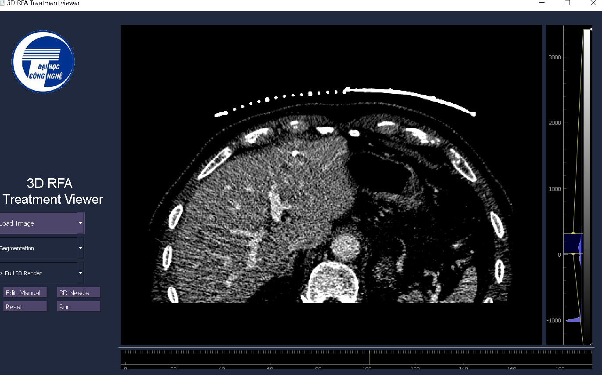
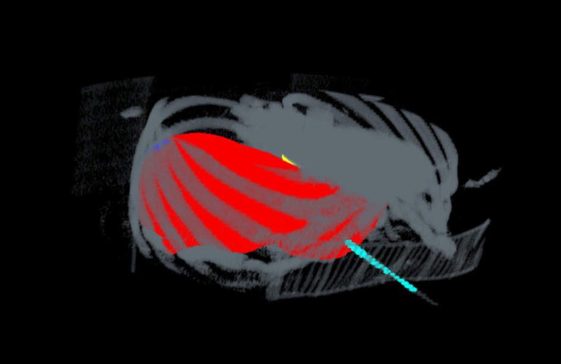
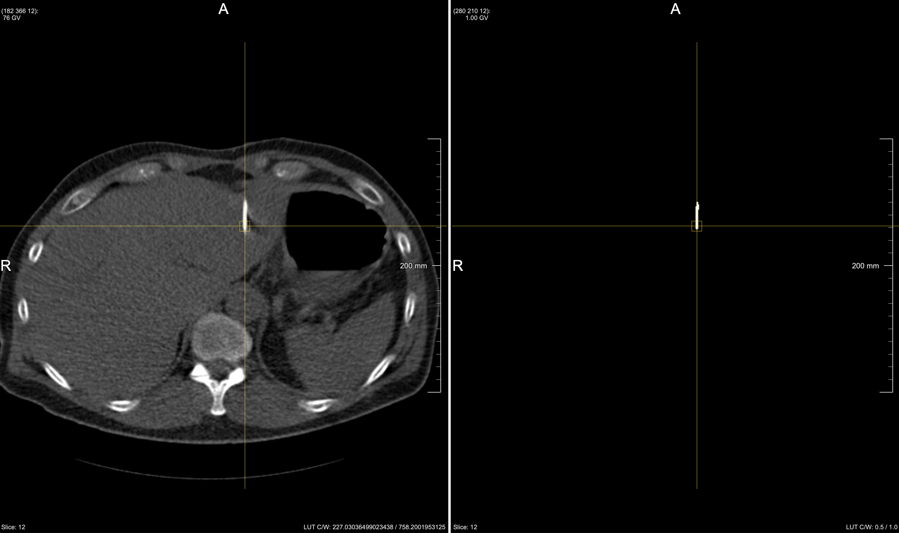
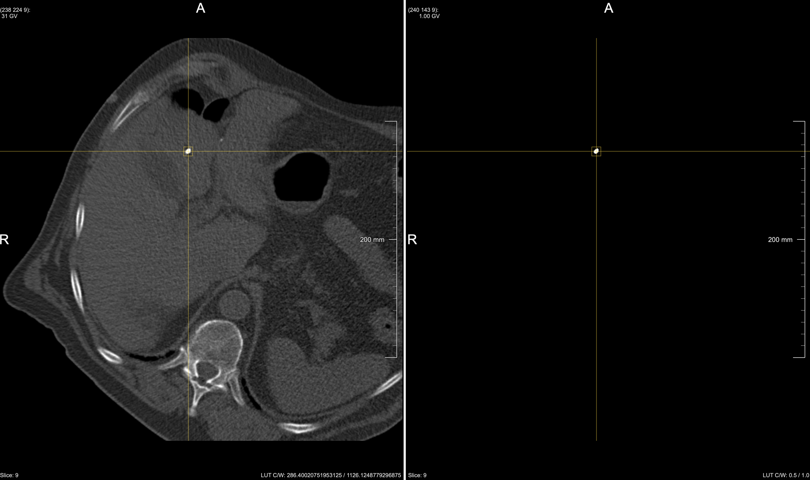

# Accurate Localization of Needle to Support The Guidance of RFA Surgery in Liver Cancer Treatment
This git contains the source code for Chu The Thuan's Bachelor thesis \
Supervisor: Dr. Luu Manh Ha \
Mentors: Pham Xuan Loc, Le Quoc Anh

#

# Introduction
The target of this project is to accurately localize and simulate the needle in RFA liver cancer treatment. This method is expected to provide radiologists with better sense and near real time estimation of the position of the needle, which results in higher treatment proficiency. 

# Method
We divide the pipeline into 4 phases:
- Liver Segmentation
- Liver Tumor Segmentation
- Liver Vessel Segmentation
- RFA Needle Segmentation

### (A) Liver, Tumor and Vessel Segmentation
For the segmentation of liver, tumor and vessel; we reuse state-of-the-art models with high accuracy such as ResUNet, nnUNet and train with our private dataset. For specific details regarding the installation, data preparation, model training and evaluation, please refer to the following github sources:
- [3DResUNet](https://github.com/assassint2017/MICCAI-LITS2017)
- [nnUnet](https://github.com/MIC-DKFZ/nnUNet)

The source code for these phases are located in folder LIVERSEG, TUMOR-VESSEL.

### (B) Needle Segmentation
Recognizing the outstanding intensity difference between the needle and the neighbouring organs, particularly the liver, we proposed a 3D seedless region growing algorithm for light-weight and fast segmentation of the RFA needle. The algorithm is capable of auto-searching for a possible seed before applying the traditional 3D region growing, which fully automates the whole pipeline for needle modelling and visualization of the current surgery state.  

The source code for this phase is located in folder NEEDLE. Here are some successful cases of the needle segmentation using our proposed method.

